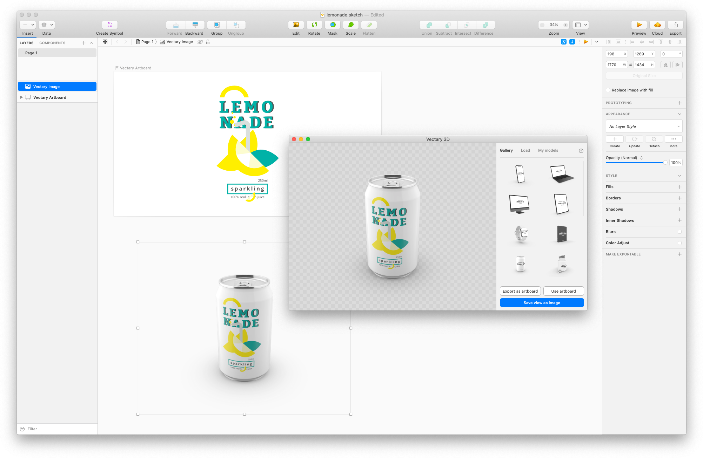

# Vectary for Sketch

Vectary plugin for Sketch is adding the missing third dimension to your 2D designs. Place your Sketch design into a predefined 3D mockup or your custom 3D element. Set your desired perspective in 3D and place the result into the scene with one click.

**Features:**
- Update mockups from Gallery with your custom design.
- Load your custom 3D model from Vectary
- Login to Vectary and access all your personal and team projects in one click

**[Download the latest version](https://github.com/vectary/vectary-sketch-plugin/releases/latest)**

Pro tip: If you want to have a replaceable texture in your own Vectary model in Sketch, name the object and its material as “_switchable” before generating the Viewer in Vectary.

Vectary 3D plugin is powered by Vectary - the easiest online 3D design tool and sharing platform made for 2D designers. Get into the 3D design, start for free on www.vectary.com
